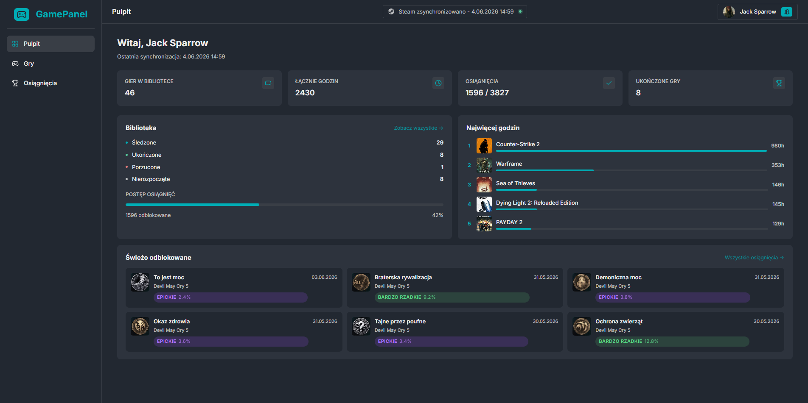
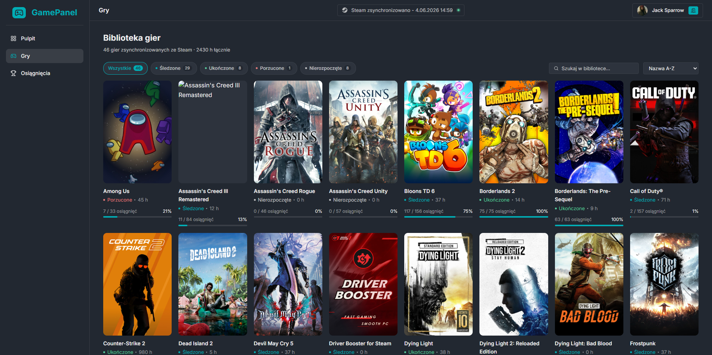
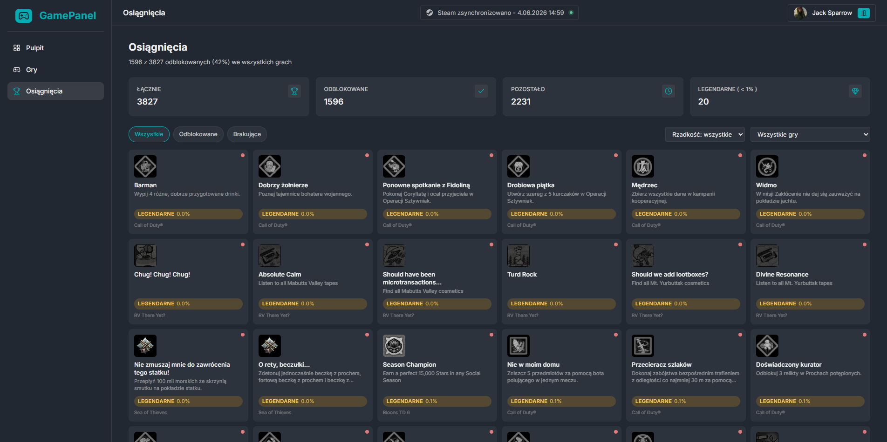

# GamePanel – Steam Achievement Tracker

Aplikacja webowa do śledzenia osiągnięć w grach Steam. Pozwala na synchronizację biblioteki gier ze Steam, przeglądanie postępów w osiągnięciach oraz śledzenie statystyk rozgrywki.

Projekt zrealizowany w technologii **Node.js / Express.js** zgodnie z architekturą **MVC**.

---

## Zrzuty ekranu

### Pulpit (Dashboard)


### Biblioteka gier


### Osiągnięcia


---

## Funkcjonalności

- **Rejestracja i logowanie** – bezpieczna autentykacja oparta na sesjach, hasła hashowane bcrypt (12 rund)
- **Integracja ze Steam** – automatyczne pobieranie biblioteki gier i osiągnięć przez Steam Web API
- **Pulpit ze statystykami** – łączny czas gry, postęp osiągnięć, ostatnio odblokowane, top 5 gier
- **Biblioteka gier** – przeglądanie wszystkich gier z okładkami, filtry według statusu
- **Zarządzanie statusem gier** – oznaczanie gier jako: śledzona / ukończona / porzucona / nierozpoczęta
- **Szczegóły gry** – lista wszystkich osiągnięć z ikonami, opisami i procentem odblokowań globalnie
- **Widok osiągnięć** – wszystkie osiągnięcia posortowane od najrzadszych, filtr po statusie
- **Synchronizacja w czasie rzeczywistym** – pasek postępu aktualizowany na żywo (Server-Sent Events)
- **Osiągnięcia legendarne** – wyróżnienie osiągnięć z globalnym odsetkiem poniżej 1%

---

## Stos technologiczny

| Warstwa | Technologia |
|---------|------------|
| Backend | Node.js, Express.js 5 |
| Widoki | EJS (Embedded JavaScript Templates) |
| Baza danych | SQLite 3 |
| Sesje | express-session + connect-sqlite3 |
| Bezpieczeństwo | bcryptjs |
| Środowisko | dotenv |
| Dev | nodemon |

---

## Wymagania systemowe

- **Node.js** w wersji **18 lub nowszej** → https://nodejs.org
- **npm** (instalowany razem z Node.js)
- Konto Steam z **publicznym profilem**
- **Klucz Steam Web API** (instrukcja poniżej)

---

## Instalacja i uruchomienie

### 1. Sklonuj repozytorium

```bash
git clone https://github.com/NAZWA_UZYTKOWNIKA/NAZWA_REPO.git
cd NAZWA_REPO
```

### 2. Zainstaluj zależności

```bash
npm install
```

### 3. Skonfiguruj zmienne środowiskowe

Skopiuj plik przykładowy i uzupełnij go swoimi danymi:

```bash
cp .env.example .env
```

Następnie otwórz plik `.env` w edytorze tekstu i uzupełnij wartości (szczegóły poniżej):

```env
SESSION_SECRET=twoj_dlugi_losowy_ciag_znakow
PORT=3000
NODE_ENV=development
STEAM_API_KEY=twoj_klucz_api_steam
```

### 4. Uruchom aplikację

**Tryb deweloperski** (automatyczny restart przy zmianach):
```bash
npm run dev
```

**Tryb produkcyjny:**
```bash
npm start
```

### 5. Otwórz aplikację

Przejdź w przeglądarce pod adres: **http://localhost:3000**

Baza danych (`database.sqlite`) zostanie utworzona automatycznie przy pierwszym uruchomieniu.

---

## Konfiguracja pliku `.env`

Plik `.env` musi znajdować się w głównym katalogu projektu (obok `app.js`). Nie jest on dołączony do repozytorium ze względów bezpieczeństwa.

| Zmienna | Opis | Przykład |
|---------|------|---------|
| `SESSION_SECRET` | Tajny klucz do podpisywania sesji – powinien być długim, losowym ciągiem znaków | `x9kQ!mN3...` |
| `PORT` | Port, na którym działa serwer | `3000` |
| `NODE_ENV` | Środowisko uruchomieniowe | `development` lub `production` |
| `STEAM_API_KEY` | Klucz do Steam Web API | `A1B2C3D4E5F6...` |

### Jak wygenerować `SESSION_SECRET`?

Możesz użyć dowolnego generatora losowych ciągów. Przykład przez Node.js w terminalu:

```bash
node -e "console.log(require('crypto').randomBytes(64).toString('hex'))"
```

Skopiuj wynik i wklej jako wartość `SESSION_SECRET`.

---

## Jak uzyskać klucz Steam Web API (`STEAM_API_KEY`)

> Klucz jest **bezpłatny** i wymaga tylko konta Steam.

### Krok 1 – Zaloguj się na Steam

Przejdź na stronę: **https://steamcommunity.com/login**

### Krok 2 – Wejdź na stronę rejestracji klucza

Przejdź pod adres: **https://steamcommunity.com/dev/apikey**

### Krok 3 – Wypełnij formularz

- **Nazwa domeny** – wpisz `localhost` (dla celów lokalnych)
- Zaakceptuj regulamin i kliknij **Zarejestruj**

### Krok 4 – Skopiuj klucz

Po zarejestrowaniu zobaczysz swój klucz API (ciąg 32 znaków). Skopiuj go i wklej do pliku `.env` jako wartość `STEAM_API_KEY`.

> **Ważne:** Klucz API Steam traktuj jak hasło – nie udostępniaj go publicznie, nie wrzucaj do repozytorium.

---

## Jak uzyskać Steam ID?

Podczas rejestracji w aplikacji możesz podać adres URL swojego profilu Steam.

### Gdzie znaleźć URL profilu Steam?

1. Zaloguj się na **https://store.steampowered.com**
2. Kliknij na swoją nazwę użytkownika w prawym górnym rogu
3. Wybierz **Profil**
4. Skopiuj adres URL z paska przeglądarki

**Przykładowe formaty URL profilu Steam:**
- `https://steamcommunity.com/id/TWOJA_NAZWA/` ← profil z niestandardową nazwą
- `https://steamcommunity.com/profiles/76561198XXXXXXXXX/` ← profil z numerycznym ID

> **Wymaganie:** Twój profil Steam oraz biblioteka gier muszą być **publiczne**, aby synchronizacja działała poprawnie.

### Jak ustawić profil jako publiczny?

1. Wejdź na swój profil Steam
2. Kliknij **Edytuj profil** → **Ustawienia prywatności**
3. Ustaw **Profil** oraz **Szczegóły gier** na **Publiczny**

---

## Struktura projektu (MVC)

```
projekt/
├── app.js                  # Punkt wejścia aplikacji, konfiguracja Express
├── config/
│   └── database.js         # Inicjalizacja bazy SQLite, tworzenie tabel
├── controllers/            # KONTROLERY – obsługa żądań HTTP
│   ├── authController.js
│   ├── dashboardController.js
│   ├── gamesController.js
│   └── achievementsController.js
├── middleware/
│   └── authMiddleware.js   # Middleware autentykacji (requireAuth, requireGuest)
├── models/                 # MODELE – logika biznesowa i dostęp do danych
│   ├── User.js
│   ├── Game.js
│   └── Achievement.js
├── routes/                 # Definicje tras URL
│   ├── index.js
│   ├── authRoutes.js
│   ├── dashboardRoutes.js
│   ├── gamesRoutes.js
│   └── achievementsRoutes.js
├── services/
│   └── steam/              # Integracja ze Steam Web API
│       ├── getOwnedGames.js
│       ├── getPlayerSummaries.js
│       ├── getSchemaForGame.js
│       ├── getPlayerAchievements.js
│       └── getGlobalAchievementPercentages.js
├── views/                  # WIDOKI – szablony EJS
│   ├── auth/
│   │   ├── login.ejs
│   │   └── register.ejs
│   ├── partials/
│   │   ├── head.ejs
│   │   ├── foot.ejs
│   │   └── modal-sync.ejs
│   ├── dashboard.ejs
│   ├── games.ejs
│   ├── games_id.ejs
│   └── achievements.ejs
├── assets/
│   ├── css/                # Arkusze stylów
│   └── fonts/              # Czcionka Inter
├── .env                    # Zmienne środowiskowe (NIE w repozytorium)
├── .env.example            # Szablon pliku .env
├── package.json
└── database.sqlite         # Plik bazy danych (generowany automatycznie)
```

---

## Endpointy aplikacji

| Metoda | URL | Opis |
|--------|-----|------|
| GET | `/` | Przekierowanie do pulpitu lub logowania |
| GET | `/auth/register` | Formularz rejestracji |
| POST | `/auth/register` | Przetworzenie rejestracji |
| GET | `/auth/login` | Formularz logowania |
| POST | `/auth/login` | Przetworzenie logowania |
| GET | `/auth/logout` | Wylogowanie |
| GET | `/dashboard` | Pulpit ze statystykami |
| GET | `/games` | Biblioteka gier |
| GET | `/games/:id` | Szczegóły gry i lista osiągnięć |
| POST | `/games/:id/status` | Aktualizacja statusu gry (AJAX) |
| GET | `/games/sync` | Synchronizacja z Steam (SSE – live progress) |
| POST | `/games/sync` | Synchronizacja z Steam (jednorazowa) |
| GET | `/achievements` | Wszystkie osiągnięcia użytkownika |

---

## Rozwiązywanie problemów

### Błąd: `STEAM_API_KEY is not defined`
Upewnij się, że plik `.env` istnieje w głównym katalogu projektu i zawiera poprawny klucz `STEAM_API_KEY`.

### Synchronizacja nie pobiera gier
- Sprawdź czy profil Steam i biblioteka gier są **publiczne**
- Sprawdź czy podany URL profilu Steam jest poprawny
- Sprawdź w konsoli serwera czy klucz API jest prawidłowy

### Błąd `SQLITE_ERROR` przy starcie
Usuń plik `database.sqlite` i uruchom aplikację ponownie – baza zostanie odtworzona automatycznie.

### Port 3000 jest zajęty
Zmień wartość `PORT` w pliku `.env`, np. na `3001`, i uruchom ponownie.

---

## Zależności

```json
"dependencies": {
  "bcryptjs": "^3.0.3",         // Hashowanie haseł
  "connect-sqlite3": "^0.9.16", // Przechowywanie sesji w SQLite
  "dotenv": "^17.4.2",          // Zmienne środowiskowe
  "ejs": "^6.0.1",              // Silnik szablonów widoków
  "express": "^5.2.1",          // Framework webowy
  "express-session": "^1.19.0", // Zarządzanie sesjami
  "sqlite3": "^6.0.1"           // Baza danych
},
"devDependencies": {
  "nodemon": "^3.1.14"          // Auto-restart serwera w trybie dev
}
```
